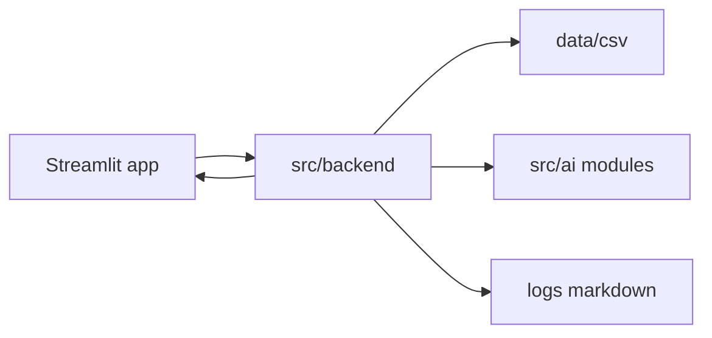

# Anime Recommender — Architecture

## Purpose

Recommend anime titles to users from natural-language or structured input (preferences, mood, genres). The system will combine a **Streamlit** UI, a **Python** backend under `src/`, optional **AI** components (e.g. LLM or retrieval), and **CSV** datasets in `data/`.

## High-level layout

```text
project root
├── app/                 # Streamlit UI only; calls into src
├── config/              # ``config.py`` loads ``.env`` (``OPENAI_*``, ``HUGGINGFACE_*``)
├── faiss_db/            # Persisted FAISS index (VectorStoreBuilder / pipeline)
├── pipeline/            # AnimeRecommenderPipeline singleton (retriever + recommender)
├── data/                # CSV datasets; see docs/data.md for schemas and preprocessing
├── docs/                # architecture.md, data.md, rules, agent context, tasks
├── logs/                # Runtime logs (Markdown; see docs/rules.md)
├── utils/               # Shared utilities (logging, errors, cross-cutting helpers)
├── src/                 # Backend + AI modules; includes vector_store.py (FAISS + OpenAI embeddings)
├── .env                 # API keys and environment-specific values (not committed)
├── Dockerfile           # Streamlit image (0.0.0.0, headless); see AnimeRecommender-k8s.yaml
├── requirements.txt     # Pinned Python dependencies
├── requirements.md      # Human-readable dependency notes
├── src/process_data.py   # DataLoader: raw CSV → processed_data.csv (defaults under data/)
├── setup.py             # Package metadata and install_requires
└── README.md            # Quick start and tech stack
```

## Target pipeline (conceptual)

Work will proceed in phases; this is the intended flow:

1. **Input** — User provides text or selections in the Streamlit app (`app/`).
2. **Orchestration** — `src/backend/` loads config, validates input, and routes to recommendation logic.
3. **Data** — Static anime metadata from `data/*.csv`. The recommender should prefer **`data/processed_data.csv`** when a single text field per title is needed; that file is produced by **`DataLoader`** in **`src/process_data.py`** ( **`input_csv`** → **`output_csv`**; defaults: **`data/anime_with_synopsis.csv`** → **`data/processed_data.csv`** ). Schema, column names, and filter rules are documented in **`docs/data.md`** (keep in sync when preprocessing changes). For retrieval, **`src/vector_store.py`** builds or loads **FAISS** under **`faiss_db/`** with **OpenAI embeddings** (see **`docs/data.md`**).
4. **AI layer** — Chat completions use **OpenAI GPT** (default model **`gpt-4o-mini`**, set via `OPENAI_MODEL` in `.env`). Implement under `src/<ai_package>/` with LangChain (`langchain-openai`) or the `openai` SDK; keep submodules by behavior.
5. **Output** — Ranked list with short explanations returned to the UI; errors and audits written under `logs/` using the project log format.



## Module boundaries

| Area | Responsibility |
|------|----------------|
| `app/` | Pages, widgets, session state; no business rules beyond UI validation. |
| `config/` | Load settings; merge env; expose typed config to `src` and `app`. |
| `data/` | Datasets only; schema and preprocessing in **`docs/data.md`**. |
| `utils/` | Logging, `CustomException`, shared helpers used everywhere. |
| `src/backend/` | HTTP-free core services, recommendation orchestration, data access. |
| `src/vector_store.py` | **`VectorStoreBuilder`**: CSV → OpenAI embeddings → persisted **FAISS** under **`faiss_db/`**. |
| `src/recommender.py` | **`AnimeRecommender`**: inject retriever + OpenAI credentials; **`get_recommendation(query)`** for pipeline calls. |
| `pipeline/pipeline.py` | **`AnimeRecommenderPipeline`**: singleton; reuses **`faiss_db/`** when present else builds from CSV. |
| `src/<ai>/` | Isolated AI behaviors (naming TBD: e.g. `llm/`, `rag/`). |

## Logging

Runtime logs live under `logs/` as **Markdown** (`.md`) files so they are readable in reviews and diffs. Each entry should align with the **CustomException-style context**: human message, optional error repr, file name, line number when wrapping failures. See `docs/rules.md` for the exact line format. The existing `utils/common/logger.py` may be extended later to write `.md` or to mirror the same fields; until then, new code should follow the documented format when writing to `logs/`.

## What is intentionally not done yet

- No `src/backend/` orchestration wiring yet; **`VectorStoreBuilder`** is available for the retrieval pipeline.
- No committed secrets; use `.env` locally and document variable names only in `docs/` or `config/` examples.
